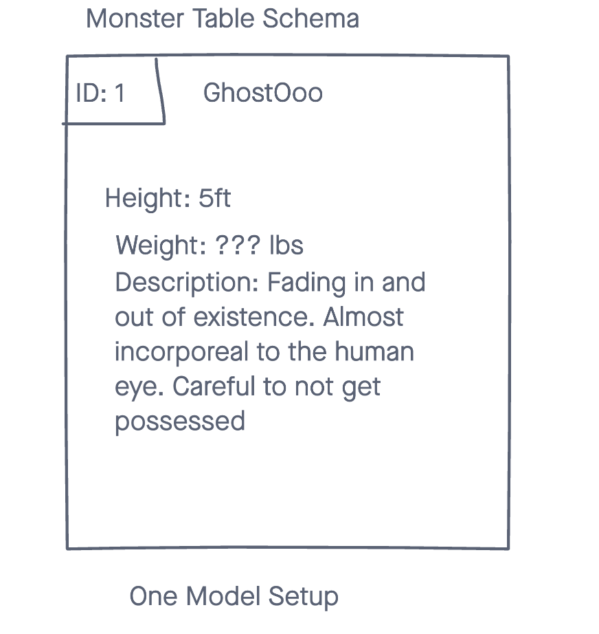

# Monster APP API

A simple web app API that stores information on monsters that are created by users on the client side. Contains various attributes such as names, weight, height, and description.

---

## Technologies Used

- Ruby on Rails
- Heroku

## Trello Board for Project Managment

 to see the project planning

## Screenshots of Planning Phase

### Wireframe Mockup

## Link to Frontend Repository

 to see the client-side repo

## Link to Live Deployment

